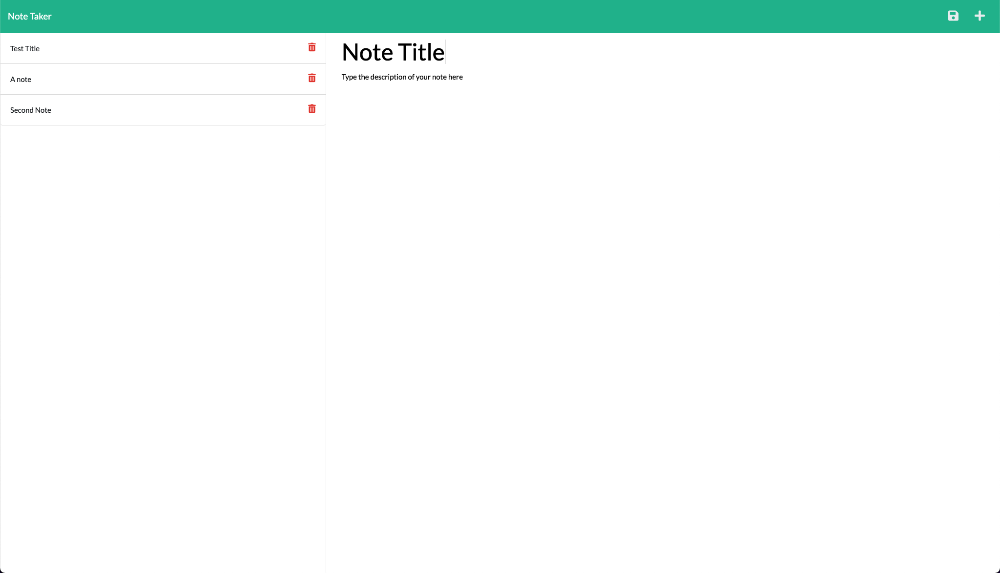

# note-taker

  ## Description
  
  A note taking web app!
  
  ## License
  
  
  ## Table of contents
  1. [Website](#Website)
  2. [Usage](#Usage)
  3. [Contributing](#Contributing)
  4. [Questions](#Questions)
  ## Website
  
  [Live Site Link](https://spo-note.herokuapp.com/)

  

  ## Usage
  
  Navigate to the website and click get started. On the next page enter your notes in the box on the right and click the save icon which appears after typing a note to save the note.

  Click on a note on the left to view the note.

  Click the delete icon on the left to delete the note it's attached to.

  ## Contributing
  
  Contact me for information.

  ## Questions
  Contact

  Github: [SeanOVery](https://github.com/SeanOVery)

  Email: seanovery1@gmail.com

